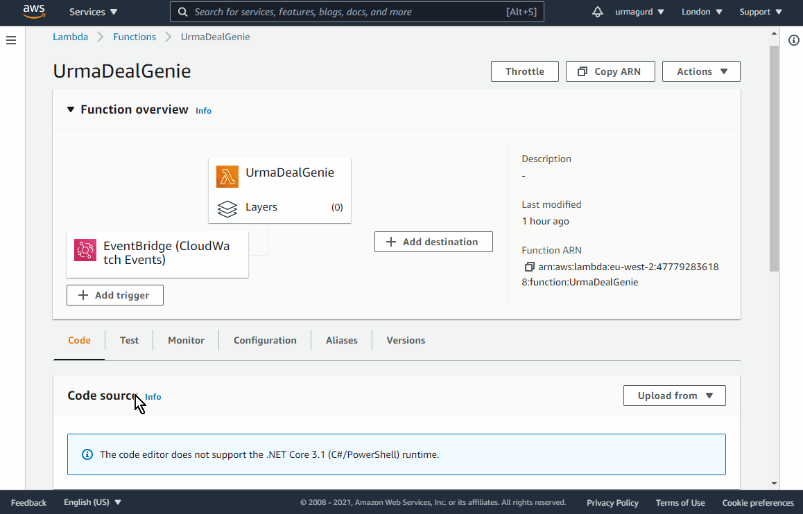

# Urma-Gurd's 3Commas Deal Genie
This is an Amazon Web Services (AWS) Lambda Function that runs regularly in the cloud, and updates configured 3Commas deals to change the Take Profit % based on sets of rules.

It requires an AWS account, and some basic knowledge of AWS would be useful. In future, if the demand is there, I can look at alternative deployment targets.

# Donations
If you got some value out of this project, please consider donating. A lot of time and effort went into creating this, and I'm hoping to expand the functionality to include more deal rules and functionality.
- [BuyMeACoffee/UrmaGurd](https://www.buymeacoffee.com/UrmaGurd)
- Binance Pay ID: 74725526 ([See how easy it is](https://www.binance.com/en/support/faq/b3fa3ae045b9429084203c3a4ff1362f))
- Crypto Wallets:
  - LTC: MQ7gP6gme9TYgRr6kHHqwxzMWRyUpgQ5dC
  - BUSD: 0xac48d07fa2738121ca4ad0e79a764eadf515fa58	(BEP20 network or ERC20)
-   USDT:	0xac48d07fa2738121ca4ad0e79a764eadf515fa58	(BEP20 network or ERC20)
-   Contact me on Discord `Urma-Gurd#6475` if you want to donate other cryptocurrencies

# Getting Started
You will need:
1. A 3Commas account that is setup with at least 1 active DCA bot
3. An Amazon Web Services account
4. Latest UrmaDealGenie.zip package

## 3Commas DCA Bots
If you haven't already, go checkout [TradeAlt's Trading Bots](https://youtu.be/ziy-9yYTrbc) tutorial YouTube playlist. It will get you setup with DCA trading bots with a safe and effective passive income trading bot setup. I cannot stress enough how important this guy's video series is! 

The Urma Deal Genie works with DCA bot deals, and uses bot names to determine which deals to apply rules to. So try to name your bots with meaningful names that represent the strategy of that bot. e.g. "TA Safer BUSD" or "BTC HODL" or "Urma 250"

### Create a 3Commas API key and secret
The Urma Deal Genie needs to connect to your 3Commas account, and it needs 
1. Go to https://3commas.io/api_access_tokens and click "New API access token" 
1. Give it a name like "UrmaDealGenie"
1. Tick "Bots read" and "Bots write"

## Create an AWS Account
Amazon Web Services (AWS) has a free tier that allows several services to run free of charge. One of those free services is "Lambda functions". These are serverless functions that allow code to run in the cloud in your own AWS account, without being logged in or needing a PC running 24/7. 
1. Go to [AWS Free Tier](https://aws.amazon.com/free/) and sign up, follow instructions and secure your account with 2FA.
1. You will need a credit card, but this is to prevent fraud and bots (see [AWS Free Tier FAQs](https://aws.amazon.com/free/registration-faqs/)

## Download Urma Deal Genie files
A Lambda function runs in the cloud, but first you need to download the code package and then upload it to your AWS account.
1. Download the Lambda function package
    - [UrmaDealGenie.zip](https://github.com/UrmaGurd/UrmaDealGenie/releases/download/beta/UrmaDealGenie-beta.zip)
1. Download the example .json configuration files
    - [test-config-update-true.json](src/UrmaDealGenie/.lambda-test-tool/SavedRequests/test-config-update-true.json)
    - [test-config-update-false.json](src/UrmaDealGenie/.lambda-test-tool/SavedRequests/test-config-update-false.json)
    - (These are identical except the first updates deals, the other just displays which deals would be affected)
 
# Installation
Below these installation steps are install videos to help visualise how to deploy Urma Deal Genie in AWS.
1. Log in to AWS
1. Switch region to your preferred
1. Go to Lambda services
1. Create function and set
    - Name = `UrmaDealGenie`
    - Runtime = `.NET Core 3.1`
1. In “Code” tab, click “Upload from”
    - Click Upload and select the previously downloaded `UrmaGurdGenie.zip` file
    - Click “Save”
1. In “Code” tab, edit “Runtime settings” to set:
    - Handler = `UrmaDealGenie::UrmaDealGenie.Function::FunctionHandler`
1. In “Configuration” tab, add “Environment variables”
    - APIKEY = `your_3commas_api_key`
    - SECRET = `your_3commas_api_secret`
1. In “Test” tab, create new Test event and save it
    - Saved event name = `deal-genie-update-false`
    - Copy / past body of `test-config-update-false.json`
    - Modify this JSON document - e.g. delete rules you don’t want, change deal rules include/exclude terms to be relative to your bot names
    - Click Save changes
    - Click Test and expand the Details and hopefully it runs!!
      - If it ran successfully, you can change UpdateDeals to “true” and see if your deals get updated. 
      - It is strongly recommended to modify the rules’ include/exclude terms fields so that the number of deals that need updating is just a few to start with.
1. Click “Add trigger” in the “Function overview” at top of page
1. Choose “Event Bridge”
1. Create new Rule
    - Name = `UrmaDealGenieCronJob`
    - Description = `Run UrmaDealGenie every 5 minutes`
    - Schedule expression = `rate(5 minutes)`
1. Click on “UrmaDealGenieCronJob” and Edit rule details
    - Configure input
      - Edit content of `test-config-update-true.json` to match your desired rules
      - Make sure `UpdateDeals: true` is present
      - Paste into `Constant (JSON text)` field
    - **Note:** Avoid editing this field after pasting, you can mess it up, easier to edit in a text file first and save it.
1. Go back to Lambda function view
1. In “Monitor” tab
    - Watch the “Error count and success rate” chart
    - Green dots/line (Success) count should be 1
    - Red dots/line (Error) count should be 0

## Install Videos

### Extra step - I missed this in the original capture!
In addition to the above, steps, you need to edit the function handler:

