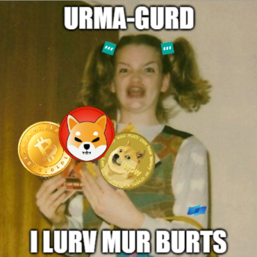

# Urma Gurd's Bot Settings
A low cost 3Commas DCA bot setting, designed to cover 60% drop with a small number of safety orders that drive the TP price down.

These settings work well with the [Urma Deal Genie](../README.md) which modifies the TP% as the deal buys more volume with scaled SOs.

## Basic concept
In July 2021 I set out to find 3Commas DCA bot settings that meet the following goals:		
- achieve at least 60% price drop coverage, just like [TradeAlt's DCA strategy](https://youtu.be/ziy-9yYTrbc)
- have strong draw down to lower average price entry, so that the bounce back up to take profit is as good as TradeAlts	
- low budget options, bot costs $250 per deal minimum but can scale up to whatever you like
- reduce the desire to overextend by providing returns that are better than TradeAlts safer settings, whilst keeping risk low	

## Settings
| Setting | Value | Setting description
|-|-|-|
| BO:SO | 10:10 | Base order size : Safety order size
| MSTC | 7  | Max safety trades count
| SOS	| 1.87% | Price deviation to open safety orders (% from initial order)
| OS	| 1.40 | Safety order volume scale
| SS	| 1.50 | Safety order step scale
| TP	| 1.5% - 3% | Take profit % - and this is what Deal Genie is designed to automatically adjust during a deal. See tips below.

## 3Commas Table and Chart

- similar to a mini express bot with the first 4 SOs across a 15% price drop
- but with a safer 60% drop protection (or safety net) with last 3 SOs across a 45% drop
- drawdown is not quite as strong as TradeAlt's

## PROS			
- With these bots the returns are good and I don't feel the need or desire to overextend.  
  For example, if I have $2000 USDT on an exchange, I can run 4 of Urma Lite, or 8 of Urma UltraLite.
- It's easier to add funds to small bots to help bring down the average entry price, rather than larger bots.		
- Running multiple small bots reduces the impact on my capital of one coin getting stuck. 
  If one bot gets stuck at 70% price drop for a while, that's a smaller % of my capital. 
## CONS			
- With so few safety orders there are big gaps between SOs 4 to 7, that means price can get stuck between SOs so not going high enough to take profit, and not dropping low enough to hit another safety order and bring TP down.
- Backtesting the May 2021 crash shows that coins can get stuck even with TA safer settings but more coins tend to get stuck with Urma bots even though overall the profit is still higher with Urma bots.

## Tips
- Watch and FULLY understand TradeAlts DCA Strategy, especially videos 1-4 in Bot Trading series		
- Don't overextend with Urma bots, keep them within your capital/bankroll as it is important that all Safety Orders are filled in a price crash		
- Use the Risk Monitor spreadsheet to manage your risk.		
- With these settings, you get a good return with low risk, you don't need to get greedy		
- Start with a low TP% like 1.5% or 2% just so you can see profits coming in.		
- After you get comfortable with low TP%, consider higher TP% like 3%. 
  Higher TP% takes longer to close deals, but the evidence suggests it returns more profit over time (see WillieB's spreadsheet) 
- Consider manually increasing the TP% on a deal when the SOs fill, like 4% on SO4, 5% on SO5, etc. 		Urma Deal Genie automates this TP% increase
- Consider 2 or more max active safety trade count (MASTC) to ensure safety orders fill in fast downward movement.   Only really needed on the first 4 SOs, so could set a deal's MASTC back to 1 once you hit SO 4.
  - **Caution** - an MASTC larger than 1 should only be used when fully funded.   Otherwise funds are locked in large volume SOs 5 6 and 7 which can cause lower SOs in newer deals to fail, which will mess up those deals.		
- Consider increasing TP% when a deal goes more than 3 safety orders on these lite bot settings to increase payout on deal close 
  DM me if you're interested in automating the modification of TP based on SOs
- Start deals ASAP, DCA bots like TradeAlts and Urma's work best when they load up on safety orders, they love substantial price dips 		
- If running a composite bot, and the exchange supports it, use RSI7 3m < 100% as the start condition (that's close to ASAP) 		
- Be prepared to add funds to a deal when it is 6 or 7 Safety Orders deep to help bring average entry price down further and close deal quicker		
- Look for coins with good daily volatility (look at "Best Pairs" spreadsheet tab for some coin ideas)		
- Don't chase meme/pump coins with poor fundamentals (possibly with exception of DOGE) 		

## See Also
- Original [Urma Bot Settings spreadsheet](https://docs.google.com/spreadsheets/d/1LgUG2TREEW3yxchwoJCXrNUdA9F7lrIxT2D2I0uxJ4E/edit#gid=65642394) including numerous backtests and comparison of settings
- (TradeAlts Discord)[https://discord.gg/tradealts] for an amazingly supportvie community that loves crypto and bots

